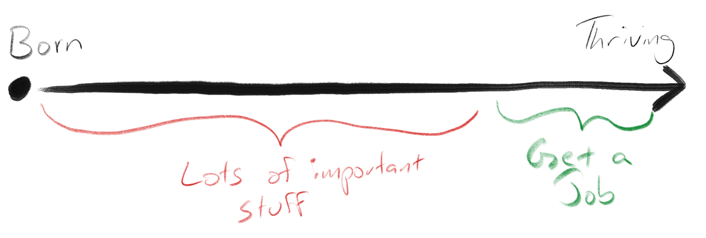

As I prepped for a panel discussion at a DEI focused conference recently, I spent some time reflecting on a lot of recent conversations I've found myself in.  In this post I wanted to try and pull together some observations and themes to share where I see attitudes falling, and share my thoughts as well.  

My goal here is not defend specific implementations of DEI, or to suggest that anyone who criticizes those things is a bad person.  I've been guilty of creating hostile environments for people.  I never thought of myself as a bad person, even in those times.  When I was able to see those situations from the other person's perspective, whether a candidate for a role or a team mate, I was horrified.  Trying to understand different viewpoints helps us expand our perspective, and hopefully effect a better world for each other.

> To me the goal of DEI is not to force statistically even groupings of demographics.  **The goal is to remove barriers that have nothing to do with someone's ability to do a job well and be paid equitably to do it.**

Generally the folks I find critical of DEI seem to fall into one of these camps.  They either:

- Don't believe there is bias in our social systems that result in some demographics having more barriers to success than others (Inequality is a Lie),
- Don't believe there is anything that can be done about those barriers (DEI is Futile),
- Don't think there is anything morally or ethically wrong with those barriers (DEI is Unnatural), 
- Or, don't think DEI is actually solving for these barriers at all and, in fact, might be making things worse (DEI is Lie).

## People who think Inequality is a Lie
We all saw a stark reminder that two people can look at the same facts and come to wildly different conclusions during the COVID madness.  People are often too quick to dismiss or even belittle people that don't see things the same way they do, but there is science that helps us understand the disconnect.  People don't interpret reality the same way, and [your level of social egalitarianism will heavily influence how you see the effects and impacts of social inequity](https://insight.kellogg.northwestern.edu/article/perceptions-of-inequality).  

I think that you can develop that sense of egalitarianism.  For me it came slowly, painfully, and through a lot of reflection about the impact I was having on the people around me.  If I could have an outsized impact on someone through thoughtless words, and if my interview techniques that seemed so sensible could turn out to be so horrible, it isn't a stretch to imagine how the fabric of our corporate world could have developed a kind of rot that all these studies and social commentators have been pointing out for decades.  In short, I increased how much I cared about the humans around me and started listening more.

## People who think DEI is Futile
Is it cynical to give up rather than play a game you don't believe you can win?  Some people think DEI is not worth their time because it won't make a difference.  For these folks I offer this perspective: the long arc of history trends to the progressive.  The media cycle today cashes in on telling you things are worse than ever before.  However, 1600 years ago people were watching gladiators fight each other to the death for fun.  765 years ago, Catholics who would have found gladiators abhorrent instead supported genocide in the form of crusades that killed Jews and Muslims by the tens of thousands.  165 years ago near where I grew up in Savanna, GA, slave owners who would have told you the crusades were a terrible mistake were instead buying humans and turning the event into a party for each other.  Today we generally agree that gladiators killing each other for sport, genocidal crusades, and slavery are all terrible things for humanity.

I can't save the world, but I get tremendous personal satisfaction out of the things I'm able to do on this front.  I've overseen significant and well deserved compensation increases over the years to address income inequality.  We've made huge strides forward in improving the hiring process that has resulted in much better representation in our candidate pools, resulting in hiring highly capable, diverse people that have made our teams better.  For those individuals that got a raise or a job you better believe their world was positively impacted.

## People who think DEI is Unnatural
At my favorite local Chinese restaurant, everyone who works there is Asian.  Is that wrong?  People who think DEI is unnatural reject the idea that society should care about demographic statistics at all.  Essentially, when presented with data that shows inequality in employment, they reply with, "so what?"

This viewpoint feels naively optimistic to me.  In a world where we've truly eliminated barriers to entry, truly recognized that all people are created equal, and have evolved past tribalism and bias, I feel like this is where we end up.  We won't talk about demographics anymore, because it won't be an issue.  

We're not there yet.  And we have to be careful not to fall into a trap of thinking that something like our Asian restaurant example is an exception that invalidates the underlying problem DEI is trying to solve.  Those barriers are real, they still exist, and there's a lot of voices out there trying to help us understand that if we can just care enough to try and listen.

## DEI is a Lie
And now for the most interesting theme I've come across.  People who gravitate to this position acknowledge there is inequality in our society, and that barriers exist for people based on gender or race, and they believe those things are morally wrong, but believe that DEI is not solving these problems at all.  In fact, if you follow this line of thinking you'll end up concluding that DEI is itself racist, because it drives people to change their behavior on the basis of race (ie, hiring quotas or admissions restrictions).

The issue I have with this argument is that it shouldn't be relevant.  Again, I believe the goal of DEI is not to enforce specific demographic standards.  **The goal is to remove barriers that have nothing to do with someone's ability to do a job well and be paid equitably to do it.**  There is no shortage of studies that conclude wage and employment gaps are real, but rather than choose metrics that encourage leaders to develop under represented talent, resolve pay inequity, or engage in socially minded programs that improve opportunities we keep looking at the snapshot of how many women VS men and white VS everyone else is currently at a company.

For folks in this camp, [Campbell's law](https://en.wikipedia.org/wiki/Campbell%27s_law) has taken effect and now they associate the DEI moniker with the corruption it warns us of.

Picture the progression of a person's life, and all the things that have to happen in order for them to end up as a well adjusted, thriving individual with a positive attitude and an ability to learn and improve.  These are the kinds of people companies want to hire.  DEI initiatives try to force companies to appear as though all those parts of the continuum of every diverse group in America is functioning well, because that would result in perfectly representative demographics in our employment.  This is what people who think DEI is a Lie are calling out.

The reality is there are a ton of social programs in place today that don't get press time that are addressing earlier elements of that continuum.  At the corporate level there are a lot of diversity focused hiring companies that specialize in career transitions and reskilling, programs like [Access Point](https://www.accesspointprogram.org/) geared towards high school students that my firm participates in, and a lot of focus being spent on internal development and mentoring to grow talent we already have in our companies into senior leadership.  

More broadly there are more controversial social programs that are trying to improve conditions earlier in a person's life which we know lead to better opportunities later.  Things like public housing, early education programs, community outreach, food desert identification and remediation are all designed to address those early life challenges.

What frustrates me about folks who think DEI is a Lie is that they almost always _also_ loudly criticize those types of social programs.  So while I think they have a point that DEI alone in the way we're currently going about it is not a total solution, they don't seem to want to support or get involved in the things that are.  Ignoring any success those programs might have to strictly focus on their shortcomings does not move us forward.  We need to be solution oriented, which is going to involve experimentation and failure, sometimes at large scale.  Wouldn't it be great if we could be as excited about million dollar gambles on investing in humans the way we do about VC's trying to get richer?

## Brass Tacks
I'd be remiss if I didn't talk about the harder reality I think is at play here: misplaced individual pride.  I know this is getting long, but it's time for a personal story...

In January of 2020 I was laid off from a role.  I'm the sole earner in our family, my wife was recovering from surgery, and there were a lot of scary stories about a new disease sweeping the globe.  I was emotionally hurt, and very scared about how I'd provide for us.

I started interviewing immediately.  I usually do well in interviews and made it to the final rounds in several roles I was really excited about.  But every time I was told they were going with someone else.  This had never happened to me in my career before.  I'd watch the company linkedin page to see who they ended up hiring, and every time it was someone who looked very different than me.  They were women or minorities, and on paper they had less experience than I had.  I felt I was better qualified for those roles, and it made me angry.


In that dark time my mind went to dark places.  I told myself these people were only getting those jobs because of DEI quotas.  It wasn't fair that a more qualified person would get passed over like that.  I remember chewing on all this as I went for long, unemployed walks around my neighborhood.

After a lot of reflection and meditation I came to a different conclusion, and not a fun one.  I got out competed for those jobs, and it didn't have anything to do with my race or theirs.  At the end of the day, all I really _know_ is that I didn't get a job I wanted.  I actually don't know anything about what qualifications or characteristics the hiring team was looking for.  I was making wild assumptions about why I didn't get the role, and even worse assumptions about what the people who got hired brought or didn't bring to the table.  It was easier to tell myself I lost because of DEI than it was to accept that the competition today is better than it was and I need to up my game to keep up.

And if I'm being honest, I have gotten _so many_ jobs I was not qualified for earlier in my career.  I did a great job bullshitting my way through the interviews, got the role, and voraciously studied and worked until I was successful.  So how is it fair for me to have benefited from opportunities like that and then turn around and get upset about someone else getting a shot?  How do I know whether they will do even better with it than I did?

We use phrases like "best qualified" as if that's some kind of objective measurement.  It's not.  Anyone who's hired people knows that.  And the kinds of qualifications that easily go on a resume are often not a predictor of whether the person will be amazing in the role.  We try to build diverse hiring teams and use consistent questions/themes for the interviews to make it as objective as we can, but there are so many elements to evaluating fit for a role that at the end of the day, you're relying on the hiring team's judgement, not a scorecard.  (PS, that's why it is so vital to have diverse hiring teams!) 

So when I hear people criticizing DEI on the grounds that you should just "hire the most qualified person for the role" I groan a little, because I know first hand how easy it is to use that angle to make yourself upset about the DEI conversation.

## Conclusion (for now)
This is obviously an emotionally charged topic, and I worry we are dangerously close to a point where some white people bifurcate into a silent, disengaged group who more and more sees DEI as a negative force, and another group that wants to help but is scared of getting it wrong.  I was scared to write this post.  But I strongly believe we need to get these questions on the table and talk about them so that we can sort these things out.  I think we all collectively need to accept that we're not going to get every DEI related effort perfect from day one.  We need to learn, improve, and stay focused on the underlying goals.  After all, when we make progress on these things _we all win._ 