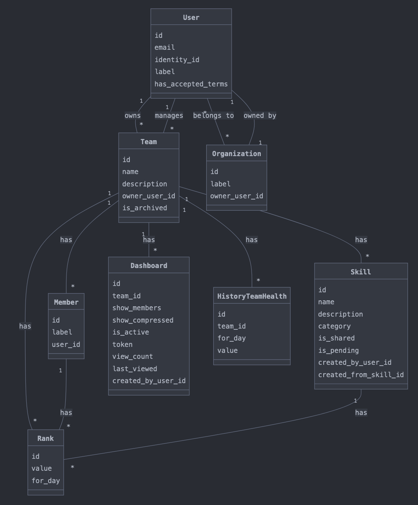

Six years ago I wrote the algorithm that drives how [Tekata.io](https://tekata.io) establishes scores for skill competency of a team.  It's not rocket science, the whole python class is only 100 lines of code.  But it uses a weighted approach and has to account for things like the size of the team and how many skills are in the list for a team.  I'm hoping to use Tekata for my graduate research so I opened the code back up and, well, I realized I didn't remember how it actually worked.

Now, I could go in and just start reading the code, running the automated tests, and I'd figure it out.  But I like making easy tasks as hard as possible, so instead I decided to try and use an LLM called [Claude](https://claude.ai) to help me remember what the code I wrote actually does.

Claude has a great feature for paid subscribers called Projects that lets you supply your own information that Claude "learns" and can use in your conversations.  You can have lots of separate conversations inside that project and all of them use the same shared information you gave it.  I think it's a really clever approach with a ton of potential.

At first I just gave it the code from the python class that does the scoring.  This worked surprisingly well.  Claude even figured out the context of the application just from reading that one class.  Claude had no problem explaining the way the scores were calculated, but now my curiosity was starting to pique.

A few weeks ago I had noticed that some teams in the Tekata database were showing scores over 100, which I was pretty sure shouldn't happen.  Claude not only explained exactly how that might happen from the code I gave it, it also generated examples of teams that would display that behavior, and it gave a fix for the code that would fix that bug.  The examples it created used appropriate skill labels like "Javascript."  So Claude figured out my app was intended to be used with technical teams to track skill levels.  Neat.

I was impressed, but I wanted to see just how far it could go.  Could Claude read my entire application's code?  If so, what could I do with that?  Turns out, more than I expected.  Strap in, we're about to get our hands dirty.

Tekata's code is split into two repositories, one for the React frontend and the other for the Python backend API.  There's well over 30k files in those two repos, so uploading files one at a time was not going to work.  There's also a lot of fluff in there (_\*cough\*_ node_modules _\*cough\*_) that weren't needed.  Claude helped me write a bash script that could pull all the files from my projects, extract just the files we needed, and concatenate them into single files.  Here's the script we wrote in case you want to try this too:

```bash
#!/bin/sh

# Function to concatenate files with given extensions in a directory and its subdirectories, excluding specified directories
concat_files() {
    dir=$1
    output=$2
    shift 2
    extensions=$@
    
    echo "Recursively concatenating files with extensions: $extensions in $dir to $output (excluding specified directories)"
    
    # List of directories to exclude
    exclude_dirs="venv37 node_modules"
    
    # Build the find command with exclusions
    exclude_pattern=$(echo $exclude_dirs | sed 's/ / -o -name /g')
    find_cmd="find \"$dir\" -type d \( -name \".*\" -o -name $exclude_pattern \) -prune -o -type f"
    
    for ext in $extensions; do
        eval $find_cmd -name \"*.$ext\" -print | sort | while read -r file; do
            echo "" >> "$output"
            echo "# ----------------------------------------" >> "$output"
            echo "# File: $file" >> "$output"
            echo "# ----------------------------------------" >> "$output"
            echo "" >> "$output"
            cat "$file" >> "$output"
        done
    done
}

# Main script
main() {
    # Check if correct number of arguments is provided
    if [ "$#" -ne 3 ]; then
        echo "Usage: $0 <frontend_dir> <python_api_dir> <output_dir>"
        exit 1
    fi

    FRONTEND_DIR=$1
    PYTHON_DIR=$2
    OUTPUT_DIR=$3

    # Create output directory if it doesn't exist
    mkdir -p "$OUTPUT_DIR"

    # Concatenate frontend files (js, jsx, tsx, ejs)
    concat_files "$FRONTEND_DIR" "$OUTPUT_DIR/frontend_code.txt" "js" "jsx" "tsx" "ejs"

    # Concatenate Python files
    concat_files "$PYTHON_DIR" "$OUTPUT_DIR/python_api.py" "py"

    echo "Concatenation complete. Output files are in $OUTPUT_DIR"
}

# Run the main function
main "$@"
```
---
 So now we have two files totalling 430KB that contain the relevant code that runs the entire application.  Claude allows you to set a Project level prompt so I used that to describe what those two files meant and how I wanted Claude to use them.  As you can see, after I uploaded the files it used up 69% of Claude's available memory.  Not too shabby!

## Data Model Inference
The first thing I asked Claude to do was create a visual representation of the database.  There are no files in the content I gave it that does this explicitly.  Instead, Claude will have to read the API code and figure out how the database works.  


This is dead on.  Not only did it nail the table and column names, it figured out the relationship between the tables.  I assume it did that by reading the business logic the API uses to enforce those relationships.

Ok cool... what else could we do?

## A planning helper
I haven't been in this code much in the last several years, but I've been thinking about a lot of new features lately.  I described one of those ideas to Claude with this rather poor prompt:
> Right now the application has some capability to allow multiple users to collaborate on a team, but there are no administrative screens that allow team owners to "invite" collaborators.  We need to add a new feature that allows team owners to manage outside collaborators.  What UI approaches would you suggest for that?

Claude listed out a bunch of ideas:
```
To implement a feature allowing team owners to manage outside collaborators, I would suggest the following UI approaches:

1. Add a "Manage Collaborators" button or link in the team settings or team overview page. This could be placed near other team management options.

2. When clicked, open a modal dialog or navigate to a new page titled "Manage Team Collaborators".

3. In this view, include:

   a) A list of current collaborators, showing their name, email, and role (e.g. Viewer, Editor). Include options to remove collaborators or change their role.
   
   b) An "Invite Collaborator" section with:
      - An input field for email address
      - A dropdown to select the role for the new collaborator
      - An "Send Invite" button

   c) Optionally, a list of pending invites that haven't been accepted yet, with the ability to revoke invites.

4. When inviting a new collaborator:
   - If the user already has a Tekata account, they receive a notification and can accept/decline.
   - If not, send an email with a link to sign up and join the team.

5. Add a notification system (if not already present) to alert users of new collaboration invites.

6. In the user's dashboard or account settings, add a "Teams I'm Collaborating On" section to show teams they've been invited to or are already collaborating on.

7. Consider adding fine-grained permissions, allowing owners to specify exactly what collaborators can do (view only, edit skills, edit members, etc.).

8. Implement an audit log to track changes made by collaborators for accountability.

This approach provides a centralized and intuitive way for team owners to manage collaborators, while also giving collaborators easy access to teams they're invited to join. The UI would be consistent with the existing team management features, making it easy for users to understand and navigate.
```

I won't add everything in here because I think you're getting the idea.  I had a good back and forth conversation with Claude about these ideas, refining them until we arrived at an approach I thought would work well.  Then I asked Claude what we would need to change in the code to implement these changes.  It listed out each file and described what would need to be done to it, showing example code changes along the way.  

## There's always a but...

I really wanted to criticize the code Claude generated, but honestly it's fine.  The only thing I noticed is that I had to ask Claude to update the automated tests as well.  This is something you could easily fix by changing the Project level prompt to tell it to always include updates to automated tests when suggesting code changes.  

The biggest pains points in this whole thing all have to do with how the LLM is fundamentally disconnected from the codebase.  The workflow of flipping back and forth from a browser to an IDE to implement those code changes is annoying.  And you likely won't do _exactly_ what it suggests, so after making a bunch of changes this way you'll have to regenerate and re-upload your source code files.  This will likely make any prior conversations break, so you may have to create a new Project altogether.

I anticipate that fairly soon we will see native integrations with powerful LLMs like Claude with IDEs that make that irrelevant.  There are already plugins you can add that sort of do that.  Apple's upcoming Intelligence related products may help even more by running some of the LLM locally.  I don't feel like any of the annoying short comings I ran into are actual long term problems.

## Will AI replace software developers?
We see this question almost every day... **_Will AI replace software developers?_**  I think that's too hard to call yet.  There are reports of that happening already but it's not clear whether that's viable for those companies long term yet.  When I think about the things software engineers do every day, there is so much tacit knowledge involved I just don't see how an LLM could know enough to practically and fully replace one of those people.  Claude can keep all my source code in it's brain, but it doesn't know anything about business plans, emails I exchanged with users, comments people made at a conference, a research paper I read about competency models... I could try to feed all these things in but there are practical limits to how much context these LLMs can handle right now.  

More fundamentally, researchers have been exploring the concept of [the structure of knowledge](https://www.jstor.org/stable/40970729) for some time.  If there is a kind of inarticulable knowledge that humans rely on to make decisions, then it would be impossible to replace a human with a machine intelligence.  That means that the way companies operate and leverage software engineers today is a fundamentally human and irreplaceable role.  But like Captain Kirk and his no-win scenario, maybe someone will figure out how to change the rules of the game and what we think of as product development will be replaced wholesale by a process that AI can actually handle. If it is possible to do that, economic pressure will surely bring it about eventually.

All that said, I think it's soon going to be common to include an LLM like Claude as an **additional** member of a software team.  Need a quick and dirty estimate of the work involved to implement a story?  Today a Product Owner asks a tech lead for a rough estimate for a new feature which they provide _while juggling eight other tasks and inquiries._  Claude could evaluate the feature idea, mock out the code changes it would make to implement it, compare those changes to other features the development team has done recently and to the estimates the team gave for those changes, and give a comparable story point estimate in a few seconds.  Or it could consume information from change systems and estimate the hours the team will spend.  There's so many options here.

Similarly, the engineers could use it to help them plan out their work.  It doesn't have to be perfect, it just has to be good enough to help the team make sure they don't miss things as often when tasking out a story during sprint planning, improving their predictability and quality.

It can absolutely help write automated tests, or help an engineer think about different approaches for implementing a change and modeling out ways the code might break under different conditions.  It will be a fantastic [rubber ducky](https://en.wikipedia.org/wiki/Rubber_duck_debugging). It may or may not make the actual work of coding faster, but it absolutely will help write better, more complete, more resilient, and more secure code.  Developers have to balance cutting some number of those corners against deadlines today, but an LLM might make those kinds of shortcuts unnecessary.

The other obvious strength is helping onboard new hires.  Want to know how some code works, or where all the places are in the code that calls a certain method and how they use the results, or any of the thousand questions a new developer will have about complex code they've never seen before?  Sure, the senior devs on the team are there to help, but Claude could massively reduce the number of times those senior devs have to get tapped on the shoulder while the newbie is getting up to speed.

## Conclusion
I'm a big believer in the idea that technology which helps enhance the human experience tends to get traction.  I think there are a million ways that current LLM and AI technology could do that for our technology departments.  Personally I'm excited to see how this are keeps evolving.