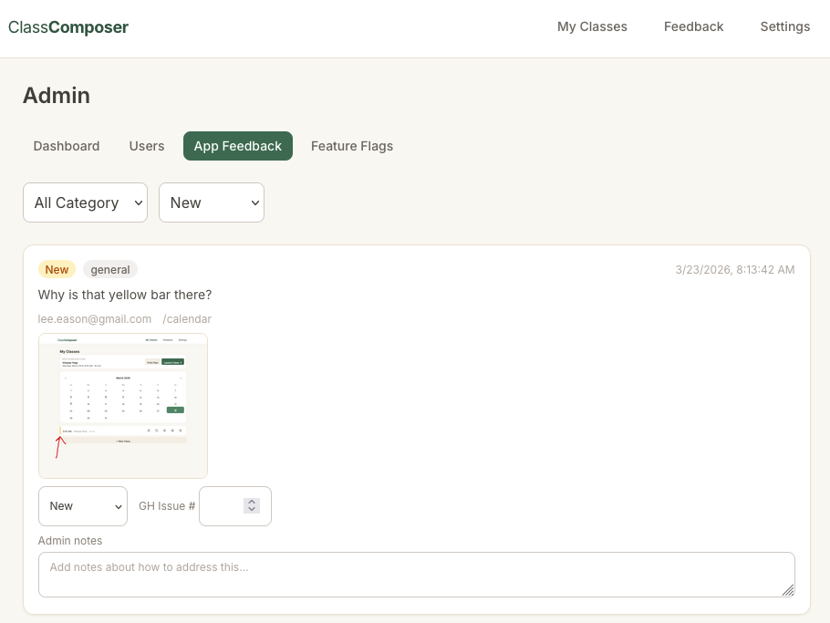

I've been building [ClassComposer.app](https://classcomposer.app) the past few weeks in my spare time.  It's a tool for fitness instructors that helps them manage their schedule, plan their classes and music playlists, and get feedback from their students.  Originally I built this for my wife who's a yoga teacher, but then decided it could be a good context to get my hands dirty and learn more about what tools like Claude Code are changing for developers and startups.

I've mentioned this in a LinkedIn post already, but this experience has really solidified that time-to-build is already compressed by around 30x.  I still believe this is going to [cause problems for a lot of SaaS companies](https://eason.blog/posts/2026/03/tertiary-companies-in-trouble/).

## Value of Feedback
Incorporating user feedback is at the heart of agile development, but it's easier said than done.  Budgets often don't create enough space for small improvements.  Your users live on tiny islands, screaming into the night, totally unaware of your beautiful strategic roadmap.  Application usability is often a victim of "death by a thousand cuts." 

If you peruse any of the sub-reddits where micro-saas builders and vibecoders hang out you'll see a theme: once you get users, if you want to grow you will need to pivot based on what they tell you.  The builder thought everyone wants X, but real users showed it was really X^y that drives sales and adoption.

The challenge is figuring out your ^y.

## The Claude Code Feedback Loop
For ClassComposer, I built a mostly-automated system that helps me digest user feedback and incorporate it into actual changes to the app.  My users can click a little "Feedback" button that lives in the bottom-right of every page in the app.  When they do that, it captures a screenshot they can draw on and then add some comments.  Those submissions then show up in an admin-only area of the app.  I review each submission, add some notes, and either accept or reject it.  Here's what that screen looks like for me: 

Once I have accepted some feedback I can trigger the automation workflow.  Here is what that looks like - note that the green shapes represent things I do VS the purple shapes that are automated or are done by Claude Code via skills:

```mermaid
flowchart TD
    A[User submits feedback via in-app panel] --> B[Review feedback in admin dashboard]
    B --> C{Accept or reject?}
    C -->|Reject| D[Feedback closed]
    C -->|Accept| E[Admin adds notes to aid in implementation plan]

    E --> F["/feedback-triage" queries accepted feedback without linked GitHub issues]
    F --> G[Groups similar items and checks for existing issues]
    G --> H[Creates or links GitHub issues and updates feedback records]

    H --> I["/start-feature" reads issue, explores codebase, writes plan]
    I --> J{Approve implementation plan?}
    J -->|Revise| I
    J -->|Approve| K[Agent creates branch and implements feature]

    K --> L[Test changes in dev environment]

    L --> M["/wrap-up-feature-branch" reviews code, updates docs and marketing site, runs test suite]
    M --> N[Agent creates PR and passes CI]
    N --> O{Approve and merge?}
    O -->|Changes needed| M
    O -->|Approve| P[Squash merge, issue auto-closes]

    P --> Q["/feedback-release" finds feedback linked to closed issues]
    Q --> R[Marks feedback resolved, generates 'recent updates' on marketing site]
    R --> S[Drafts thank-you messages for users whose feedback shipped]
    S --> T[Review and send thank-you messages]

    T --> U[User sees their feedback on the updates page]

    class A,U user
    class B,C,E,J,L,O,T human
    class D closed
    class F,G,H,I,K,M,N,P,Q,R,S automated

    classDef user fill:#f9f5f0,stroke:#6b7c6e,color:#333
    classDef human fill:#e8f0e8,stroke:#6b7c6e,color:#333,stroke-width:2px
    classDef automated fill:#e8e0f0,stroke:#7b6c8e,color:#333,stroke-dasharray:5 5
    classDef closed fill:#f5e6e6,stroke:#c0a0a0,color:#666
```

As you can see, there's very little "work" for me as the site admin.  I keep myself in the loop as a product manager, making decisions about what feedback to accept and adding my own thoughts about how to do it or what the user might mean.  Case in point: one of my users wanted a button label changed, but it was because they didn't understand the site was auto-saving their changes.  I put that in the notes for the item so the implementation plan Claude wrote didn't try and change the label like the user asked, it made it clear that changes were being saved automatically.

The grouping step is really helpful.  If multiple users submit similar feedback, all I have to do is accept them all in the admin panel.  Claude figures out they are all related, creates a single GitHub issue to capture the work to be done, and links all feedback items to that single GitHub issue.  Once that issue is completed, each user gets notified individually, but we never had to deal with duplicated work items.

All I do is trigger the skills, review plans, and do manual testing.  The marketing site is automatically updated with any new features, the updates page gets updated, emails to users thanking them and letting them know their feedback matters and got incorporated, all that gets done by the bot.

### Implementation Compression Enhances Innovation
Claude Code didn't create a new technical ability here.  None of this is a revolutionary new technology.  Teams have built these kinds of things before.

The difference is accessibility.  Before, a single-person startup or small company would almost certainly not have built this level of automation.  But Claude Code makes it incredibly fast and easy.  I don't even write the Skill files themselves directly - I describe what I want the Skill to do and Claude writes it for me.  All I do is tweak it and test it.

## Exploiting Human Laziness
As we build up meta-agents that will turn my green shapes into purple shapes, one thing we'll have to figure out how to do is incentivize them to be lazy like me.  I wrote these automation agents because it meant I had to do less.  The fact that they are more consistent, faster, and do much better work than me is a huge bonus as well.  

We're going to want our meta-agents to identify parts of it's workflow that would benefit from being offloaded to a Skill, Rule, or Hook.  Otherwise the meta-agent will burn tons of tokens on each iteration to try and achieve consistent quality.  If we incentivize them to optimize their own workflow and allow them to self improve then we'll find them building all kinds of interesting automation helpers like I did here.  That will end up costing less to run and produce much better output.

One last note: if any of you reading this are wondering if you should be trying to get your own hands dirty with these new tools please please please listen to me: the answer is yes, you absolutely do.  You can read all the blog posts like this world, but you'll learn more in a weekend of tinkering than a month of reading.  Just find a project and dive in.