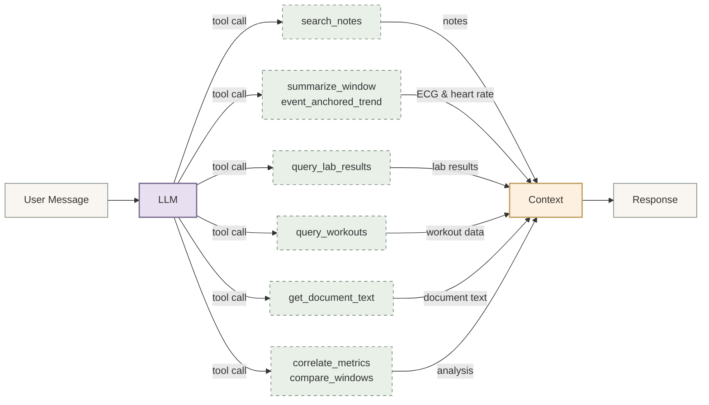

A few years ago it was common to have a great idea, think about it for a few days, and then realize that it was going to be a ton of work and forget all about it. Now, though, you can build every dumb idea you have with very little time or effort. As a lazy "idea guy" this is paradise.

## The problem
To make a 17 year long story very short, I have been dealing with heart related issues that have led to me learning far more about cardiology than I ever wanted to know. But even after all that learning, I'm still not a doctor, and I find myself confused and struggling to understand post procedure notes or assess my symptoms. I recently had a fairly major procedure done and I'm navigating recovery, but it's not easy.

I'm not alone. A 2009 study found that few patients understand the procedure they are consenting to, or the risks.[^1] A 2021 study found that extended to clinical trials as well, meaning most of the people signing up didn't understand what they were signing up for.[^2] There are many studies on this subject and they routinely replicate those findings.

Anyone who's been through a surgery or dealt with serious health issues will not be surprised. My father has been battling cancer for two years. We regularly have to dig through notes and doctor feedback, then do online research to try and understand what's going on. We just don't think to ask the right questions during an appointment and don't feel it's worth bothering the staff with one off messages through the portal.

## What I built
First, I'm well aware OpenAI is launching a health product. I'm on the waitlist. But like I said, I just had a big thing done and I also hate waiting.

My personal health assistant collects data from three main sources:
- PDFs I upload from visits, post procedure notes, labs, etc.
- An iOS app that streams workouts, ECG data, and resting heart rate from Apple Healthkit. It does this as a background task or I can click a button to trigger it right away.
- Me, when I chat with it.

The app has a few main capabilities. All of them feed into Chat, so let's start there.

### Chat
This is the main value of the app to me. Essentially this whole app exists to feed context into Chat conversations. These are the main MCP tools that do it:

- **summarize_window:** Summarizes health metrics over a date range. Pulls resting heart rate, HRV, step count, ECG stats (PVC/PAC counts, PVC rate), and daily breakdowns from HealthKit samples and ECG records.
- **compare_windows:** Compares two date windows side-by-side (e.g., pre- vs post-procedure). Returns the full summary for each window plus computed deltas and narrative hints about what changed.
- **event_anchored_trend:** Tracks a single metric (PVC count, PVC rate, resting HR, HRV, or steps) anchored to a timeline event. Returns pre/post data points, averages, delta, and trend direction over a configurable number of days before and after the event.
- **query_workouts:** Queries workout data (running, walking, cycling, strength, hockey, etc.) over a date range with optional type filter. Returns total count, total distance in miles, total duration in minutes, total calories, average heart rate, and per-type breakdowns.
- **get_document_text:** Retrieves the full extracted text of a medical document (PDF) by its ID. Returns the filename, document type, document date, and the OCR-extracted text content.
- **correlate_metrics:** Computes Pearson correlation between two daily health metrics over a date range. Supports optional lag (e.g., does today's step count predict tomorrow's HRV?). Available metrics: resting HR, HRV, steps, PVC count, PVC rate, workout duration, workout count.
- **search_notes:** Searches user notes by keyword, kind (observation, symptom, insight, question, milestone), tag (cardiac, sleep, exercise, diet, stress, medication), and/or date range. Returns matching note text, metadata, and dates.
- **query_lab_results:** Queries structured lab results (CBC, lipid panel, metabolic panel, thyroid, A1c, etc.) by canonical test name and date range. Returns numeric values, units, reference ranges, and abnormal flags, grouped by test name.

All the data the app collects are available in LLM conversations thanks to those tools. The LLM automatically calls them. So if I say, "How is my workout and resting heart rate trend looking over the past two weeks?" it uses those tools to go get the data and give me an accurate answer.

Right now it uses OpenAI's GPT 5.2 for chat and the gpt-5-nano model for quick classification tasks. But that's a generic pattern so I can swap for Google or Anthropic models if I decide to later. I built that pattern for the ClassComposer app so I knew how to do that easily.

Here's the other interesting things the app does for me.

### Trends
This is a graphical exploration of all my different health metrics. Workouts, ECG results, heart rate, and all annotated with major health events.

### Labs
There is a labs area where I can explore lab results over time (that was the first screenshot shown above). It pulls out notable metrics: anything that has been above or below threshold, or is trending up or down. It shows me all those notable metrics in one chart, but I can click into any single metric to explore it more. There's a link on each metric that I can use to start a conversation. That basically builds an initial prompt and gets things moving in a new chat.

### Events
The event timeline shows a single view of all the major things I've experienced, like those surgeries or significant injuries. I uploaded a CT scan of my ankle from last year and it helpfully added a "you broke your ankle" event to my timeline. It's been a tough year, needless to say. These events are really important, because the LLM can draw on general understanding of these things and provide more specific feedback.

### Notes
Notes come from two sources. I can write one from the web app or the iOS app manually. I use it to jot a quick note when I'm experiencing a weird symptom as a reminder to myself. 

They also come from conversations. The app detects when a conversation is finished and creates a summary of it. If the conversation dealt with something emergent, like a discussion about a symptom or issue, that gets put in a note. It won't create notes for things like asking for an explanation of something, or explaining something from my labs, since the tools can already get to that information.

This is not unlike ChatGPT's memories feature, it's just really focused on health related stuff. But it means that the more I interact with it, the more helpful it gets.

### Documents
This is where I can upload those PDFs from doctor visits and what not. If a PDF has info about an event, like a surgery, it gets added to my timeline and linked together. If it has info about labs, those get extracted into a searchable database so I can track them over time. The system normalizes the labs because over time sometimes units of measure or labels change. The text of the PDF gets indexed for easy searching too. I use an LLM to help classify and extract all that information. So far I've processed about 15 years of labs and procedure documents. That worked out to 570+ records of labwork, which was really cool to see.

### Import
This was a temporary capability I built to test the whole concept. It can upload an export of the Apple Healthkit data from my phone. My .zip file was 180mb, so it's a ton of information and not really easy to work with. You have to export it from your iPhone which takes a while, save it someplace, then extract it with your laptop. There's thousands of csv and xml files. I quickly pivoted to just building an iOS app after messing with this process a couple of times. Trying to get updated ECGs and workouts every day would be brutal if you had to use the export process every time.

### Settings
Here I can tell the system about myself. Age, description of my history, personality, etc.  That gets used in the system prompt. This area also displays a QR code used to pair the iOS app to my laptop where the backend and web app runs. It tells the iOS app how to find the backend and creates a secure connection using a private token.

## Value
I'm chatting with this thing a good bit, and it has been surprisingly useful. You could get similar results if you just upload all this data to ChatGPT or a similar tool, but I've tried doing it that way and it's a pain. Just getting the apple healthkit data is tedious. Plus, having a way to peruse my lab work is really cool. 

For example, I knew my good cholesterol was really good, but I didn't realize just how above normal it was until I saw these charts. Being able to chat with the LLM about why that might be happening, and it being able to see _all_ my labs over 15 years enabled it to give me a super detailed explanation about what was going on there. Again, very aligned with what my primary care doc had explained before, but much more thorough.

I also wanted to know if it was safe to try and skate tonight at my son's hockey practice. The answer was very much inline with what my doctor advised, which was reassuring. The difference is that my chat conversation knew detailed information about my symptom trend, how I've been tolerating daily walks, my resting HR, and the rate of ectopy in my ECGs over the past week.

## Cost and Time
I built this whole thing in my spare time in a couple of days. It's about 24k lines of code across python, swift, etc. I got to finally learn how to deploy an iOS app in development mode, which was fun.

So far my API costs to run this are less than $5.  It's amazing what you can do right now on just a few bucks if you are smart about which models to use for which tasks.

## What's next
I am keen to create a "prepare for appointment" type capability. It would somehow pull together key questions I should to my doc about at an upcoming appointment based on all the observations and issues I've had. Since it would know which doc I was seeing it could tailor things to that specific person. But it's wonky since the app just runs on my laptop so I have to decide if I'm deploying this or creating some kind of workflow to solve it.

Nirvana would be having this tool be able to connect me to my care teams when a conversation wanders into dangerous territory. The LLMs can detect that. So imagine I am chatting, and mention what feels like a benign issue (sharp chest pain). The LLM knows that's a potentially big issue so it asks me for permission to pull in my care team. It uses the MyChart portal and creates a new conversation with my team, but it can pull in all the relevant context from the app and share that with them. Further, they can even ask it for more information if they need it. That way my care team has everything they need to make an informed decision and give me really specific guidance.

There is no way I'd try and run something like this as a platform for other people. It's a HIPAA nightmare and I don't want to be responsible for other peoples health data anyway. That said, it would be interesting to make a version of this to use for a loved one. My mother could really use something like this to help her keep up with things for my dad. I'm sure that's not uncommon.

If you read this far and you are really interested in trying to set up your own instance of this, let me know. I'm not opposed to open sourcing the code but it might take some work to make sure others can get it running easily enough.

[^1]: https://pubmed.ncbi.nlm.nih.gov/19716887/
[^2]: https://pmc.ncbi.nlm.nih.gov/articles/PMC7807905/?utm_source=chatgpt.com