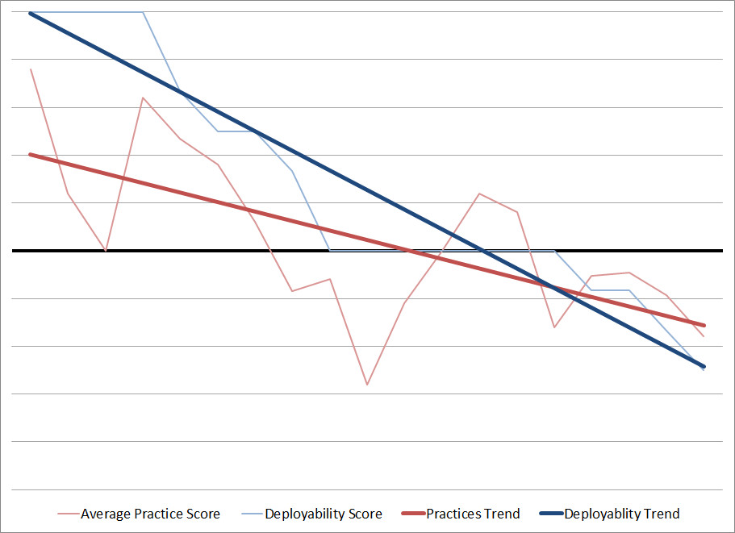
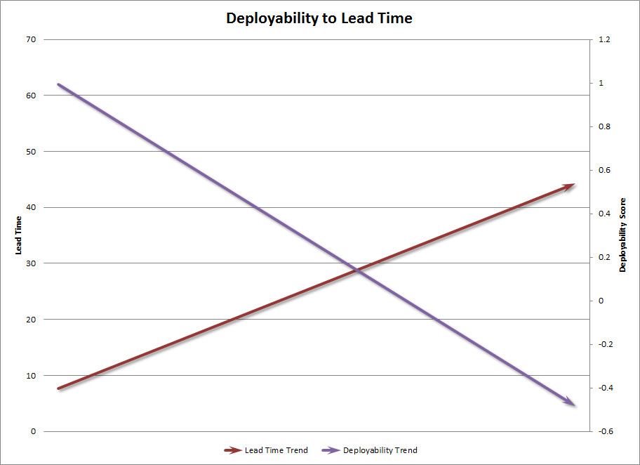

If you accept that you can’t improve what you don’t measure, then you may have a real challenge on your hands when you start trying to improve the health of your teams.  [Anything can be measured](https://codeascraft.com/2011/02/15/measure-anything-measure-everything/) but not everything can be measured easily.  Google, for example, has an entire team that employs scientific measurements to [all kinds of things](https://hbr.org/2013/12/how-google-sold-its-engineers-on-management) to try and figure out which teams are really healthy, and what makes them so.  However, for most organizations, that’s a tough expense to justify.  Most of us have to do it the old fashioned way: by guessing.

However, there’s a better way, and it starts with Deployability.

# What is Deployability?
Deployability is a subjective meta-measurement that gives insight into how healthy your teams are.  You can think of it like a Net Promoter Score (NPS).

## NPS Refresher
NPS is an efficient way to measure the health of the relationship between your company and your customer.  NPS incorporates customer support, marketing, branding, on-boarding, quality, reliability, and value delivery.  You measure NPS by simply asking your customers: **How likely are you to recommend our product to a friend or colleague?**

The theory behind NPS is simple.  Any of those areas mentioned above are going to be taken into account when your customer considers that question.  It’s tedious to try and get customers to reflect on those areas individually.  There is contention around some of the ways that NPS gets applied, especially when you try to link it to revenue growth.  However, there’s good consensus around using to do things like build customer centric teams.  

# Applying these lessons to our teams
Deployability works off the same theory.  You ask your team members a simple question: **How comfortable are you deploying code to production?**

What considerations go into answering that question?  Frequency of _post-release defects_, _downtime_ required, _scheduling_ of the release (overnight, over a weekend, or over lunch),  count and _complexity_ of changes, ease of _rollback_ if something goes wrong, _quality of monitoring_ to find issues proactively, quality of _automated tests_ and coverage, reliability or availability of _automation_ for the actual push to production, complexity of the environment and number of _shared resources_ with other services or applications (load balancers, application servers, web servers, databases)… all these things and more if the team member is being thoughtful about the question.

While all these things can and should be tracked individually, for many organizations just getting started with DevOps, that list can be daunting.  Many teams don’t have tools in place that capture that information yet.  Deployability, like NPS, is a valuable way to start capturing a look at your team health from a high level.  Like any good metric, answering that question leads to lots of even better questions.

# Methods and Surprising Answers
There are lots of methods to capture Deployability.  Our team will be building a Slack bot soon to track this in more of an ongoing fashion, and we want to build that into some ChatOps tools we are going to be rolling out.  You could capture it in Jira or whatever ticketing system you use if you use Release tickets to represent deployments and change-sets.  For us, a survey in Survey Monkey was the easiest way to start out and it works just fine.  

## Some fun surprises
### What the heck, testers?
In our survey, we capture the team the person is part of, and their role on the team, though we keep individual responses anonymous.  This gives us a chance to see how roles might influence perception.

One thing that was interesting was that on teams where the testers were somewhat removed from the release and verification process, the tester role’s deployability scores were markedly higher than on teams where the testers were much more involved.  In both cases there was a lack of test automation, but some teams used account managers for the deploy event and post-deploy verification.  The testers on those teams were not as incentivized to push automation as the testers on other teams.  For them things weren’t so bad without that automation because the pain was mostly on other roles.  By moving the testers on those teams closer to the deploy process, they saw first-hand why automation is so critical.

This same principle plays out for other roles like Product Owners and Managers.  It needs further study, but there may be good reasons to get those folks more involved with deployments as well.

### Shared Resources Suck
When a team goes to create a new service they sometimes get resistance when asking for VM’s or servers to deploy them on.  The argument goes thusly: Why not just put the service on an existing app server?  IIS can easily handle the load from the new service.  Why do we need a new database server?  The license is expensive and we have capacity on an existing DB server.  The problem with this argument is that you are optimizing for the wrong thing, and Deployability highlights this.

Teams that share resources have lower Deployability scores.  It makes sense, because sharing resources complicates the testing and deployment process.  Typically a shared resource is bigger and more expensive than commodity hardware that could have served an individual service.  This means that lower environments tend to not have that same hardware in it, which increases risk yet again since we can’t actually test our changes in the same conditions as production.  Making changes to those shared resources requires getting approval from the other teams that use them, and could mean downtime windows for those other applications even though you’re probably not delivering any new value to them during your deployment.  It’s a bad situation that creates a lot of friction for the teams.  This attempt to save money by increasing our datacenter density can actually end up costing you more.

Warning: Fuzzy math ahead: Let’s say your teams work about 245 days a year on average.  An average scrum team of 4 developers, 2 testers, a PO, and a Scrum Master is going to cost your company at least a million dollars a year, or $510 per hour.  A medium sized server in AWS costs about $840 per  year.  That means that if your team spends even two hours over the course of an entire year dealing with the complexity of doubling up a server to run more than one application then you have lost money, and it doesn’t take long for that to happen.  At one deployment per month, each team only gets about four minutes each cycle to coordinate the release window, test for the integration, verify the other app after a deployment, and maintain any automation related to the integrated nature of the environment.  Those teams will spend four minutes at the beginning of their meetings finding a seat and saying hello.  Also remember that time spent on this coordination is also wasted opportunity where the teams could have been doing something valuable, so you should double everything again.

Bottom line: sharing resources is, at best, a zero-sum game.  You are almost certainly better off keeping services in separate containers or VM’s, even with licensing costs factored in.  Modern techniques allow for increasing density in your datacenter without doubling up services on the same server.  Besides, even .Net developers can get away from OS licenses now!

### Development Best Practices Matter

Teams that do a better job with unit testing, integration testing, automated full stack testing (selenium, for example), code reviews, pair programming, and test/deploy automation (referred to as Practices in the above graph) have higher Deployability scores.  This is also not surprising, as studies have shown clear relationships between these practices and overall quality.  When a team member is deploying code to production, in the back of their mind they’re thinking about automated tests that fail intermittently, and wondering if this time those failures might have meant something.  They’re thinking about that change they made that nobody had time to really review completely.  If the team had slowed down and dug into those tests they’d be a lot more confident pushing those changes out.  If they’d taken the time to review each other’s code, they’d feel a lot better about pushing it out even if it is pretty risky, since odds are there are a few people that can help address any unexpected issues that come up rather than just the one person who wrote the code.  Having good quality tests with good coverage helps the developers find problems sooner, especially with complicated codebases.  Good coders know if they make a big change to a central object and the unit tests all pass, there’s a good chance something is wrong.

### Lots more
I could write about other interesting things we’ve already learned from measuring Deployability, and I may do that in a follow-up if there is interest.  For example, teams that start making investments in DevOps best practices tend to see an increase in Deployability before they see tangible benefits in their deployment process.  This gets into some interesting psychology, but the metric levels out quickly enough.

# Now What?
Like NPS, you positively affect Deployability by doing several key things better.  Making investments to help your teams get better at unit/integration testing, do Test Driven Development (TDD), automate their build and deploy process, do better code reviews, pair program, or get better tools for easier monitoring are all material ways you can improve your deployability.  Smoothing out the development process and enabling them to ship smaller change sets more frequently is key.  

We care about deployability because our business must be fast and agile.  If you want your teams to release features faster, then you want the act of deploying changes to be dead simple.  It should be as natural as committing code.  As deployability scores go up, lead time (the delay between when code is written and when it goes to production) goes down, which leads to better Time to Market.

DevOps is a key part of delivering on the promise of agile.  We want to be agile as a company so that we can pivot quickly to address the ever changing needs of our customers and stay on top of our competitors.  Deployability is a great first step in exposing the areas and teams that will benefit from attention today.
