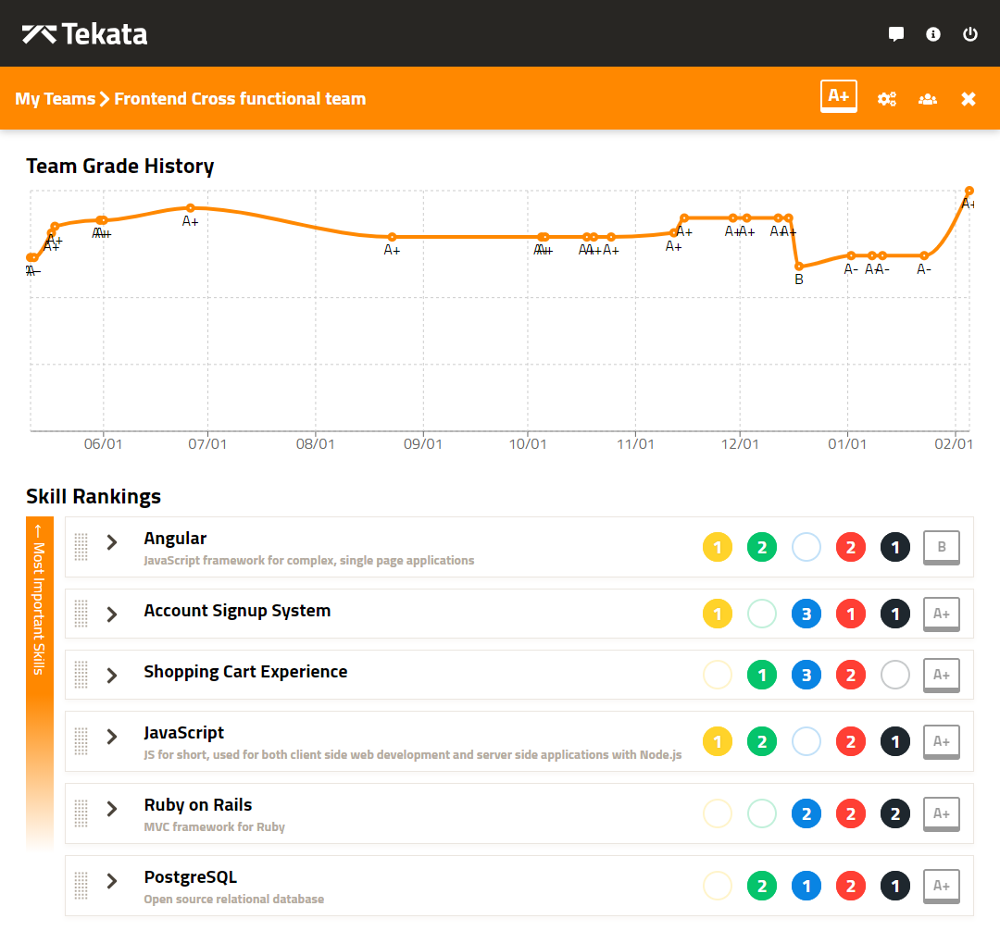
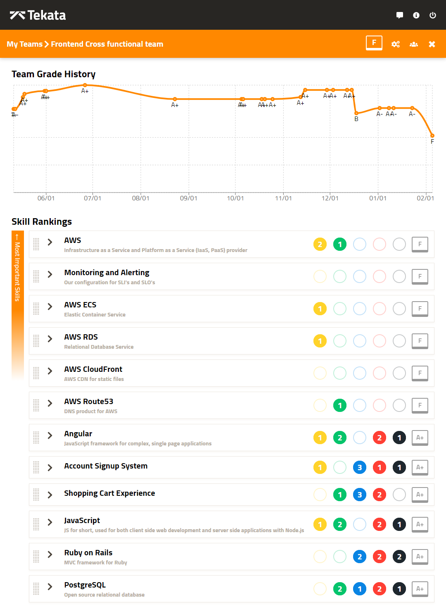

Many of us have now heard the phrase “cloud first” from an executive in a strategy meeting.  It means that all new technical services should be built on native cloud Platform as a Service (PaaS) rather than for your datacenter.  Unfortunately those strategy sessions don’t talk about the nuts and bolts of how you’ll enable your teams to get there in a healthy way, and that part of the plan becomes an assumption that will prove a very expensive one.

How expensive?  Assuming...

- Your average scrum team costs $1mm/year to fund
- With current staff and skills, each new service will need 4 weeks of remediation to fully operationalize it based on findings from a [well architected review](https://aws.amazon.com/architecture/well-architected/).  This is a conservative estimate I can personally vouch for.
- Your company will produce 300 new services over the next several years.  Given that Uber has 1000+ services powering their platform, 300 is pretty conservative for most enterprises.

**($1mm per year / 52 weeks) * 4 weeks of rework * 300 new services = $23,076,923**

This means you will be adding $23mm+ in new technical debt over the next few years.  Since your push to public cloud is likely supposed to get rid of legacy technical debt then you no doubt want to avoid this.

Another way to think about that $23mm figure is that it's what you are paying to train your teams on how to build healthy AWS applications.  This is learning in the school of hard knocks, by making mistakes and then correcting them.  That begs the question, is there a smarter way to build teams capable of creating healthy cloud based applications?

## Skills and Capabilities
Where does that new technical debt come from?  Why do teams have to do so much remediation when they are first going to the cloud?  There are two primary reasons.

### Operational Model Shift
The scope of responsibilities we need our teams to take on is drastically larger than in the old operating model.  Historically, IT would provide a slew of services that software development teams rarely understand well enough:

- Networking and network security; air gaps, subnet architecture, firewalls, security groups
- Vulnerability management; risk classification, patches, penetration testing, and reporting
- Change management compliance
- Financial reporting
- Service Level Indicators and Objectives definition and tracking
- High Availability, and disaster recovery planning and testing
- 24x7 on call tier 1 support

Software teams often complain about how long IT takes to get something done, but seldom appreciate the complexity or critical importance of the above list.  Using public cloud doesn’t relieve your firm of those responsibilities.  Rather, the ownership of them shifts from a central IT organization to the software development teams.  IT may provide central services to make that easier, but service ownership lives with the development teams.

This is why the role of Site Reliability Engineering is gaining so much traction.  SREs help fill this gap on teams by injecting operational excellence as another aspect of software development.  But the reality is that every person on your teams has to learn how to operationalize their services and own that responsibility.

### Architecture and Service Choices
When a software team is handed the keys to their very own datacenter, which is what you do when you give them access to a public cloud account, and they see the scope of what this new datacenter can do for them, it is exciting and daunting.  There are 137 different products and services spread across 23 categories in AWS alone.  

When your team sits down to build a new service in AWS, how do they pick one of the nine different storage services offered?  How do they choose which of the eleven different database services works best?  How do they decide between EC2, ECS, EKS, Fargate, Lambda, Beanstalk, or Lightsail for compute?  Just within EC2 there are 169 different sizes and types of servers to choose from, each one optimized for different needs.

In order to make these decisions you have to have deep knowledge both of what you are building and how that workload will operate in AWS.  Choosing the wrong service, not understanding how it works at a deep level, or not configuring it properly will add weeks or months of technical debt to your products.  The best way to avoid that is to invest in proactive training of AWS Solutions Architects as part of your go to cloud strategy.  Your builders need to become experts with the tools you’re asking them to use to build the next generation of your enterprise platform.

There are deeper and more specialized courses and content that go farther than the Solutions Architect approach.  Once your teams have made some initial choices about which AWS products they’ll use, it’s worth it to go farther with their education.

## Gap Analysis and Tracking Success
An enterprise needs to have visibility into the skill gaps we now see exist on our teams, and a way to track progress against getting teams back to a healthy state.  Let’s look at an example using [Tekata.io](https://tekata.io), a free tool that helps organizations optimize hiring and training decisions.  (Full disclosure, I'm a founder of Tekata.)

Our fictional team is called the Pretty Ponies.  They do cross functional development for a Ruby on Rails based application.  The application is about five years old, has over a million lines of code, decent test automation, and a few performance problems.  The frontend is a mixture of a few versions of Angular.js and needs a visual refresh.  The database is a PostgreSQL backend that now has about 75 tables in it and is 600GB in size.

Here’s what the Pretty Ponies Tekata dashboard looks like before they start their AWS journey:

The team grade history tells the story.  For a while now this team has been healthy and stable in terms of skills and expertise.  Now let’s see what happens when we ask them to refactor their legacy application into small services in AWS.

What we’ve done here is recognize that this team now has some new skills they need mastery of.  They can’t migrate their database to AWS unless they learn about RDS.  They can’t deploy Ruby on Rails containers without learning how ECS works.  There are general AWS skills, like VPC and networking, plus they need to be able to update their DNS entries via Route53.  Not to mention that now this team is responsible for monitoring and uptime of all the new services they’ll create.

So while nobody wants to see an F grade on their team, especially after being so reliable for so long, that’s the reality.  Now at least the Pretty Ponies can start to make a plan about how they’ll fill those knowledge gaps, which protects the company against creating new technical debt.  

**Identifying and resolving these skill gaps will not only cost less than the $23mm we identified earlier, it will also get you to a good state much faster.**

## Create a prescriptive training program
After using Tekata to visualize your skill gaps, you can partner with a vendor to supply targeted training to fill those gaps.  The cost of that vendor will be a small fraction of the technical debt you are avoiding.  One recent project I worked on showed the total cost of our training program was about 1% of the technical debt we were projected to add.

Another bonus is that your team members will be more engaged and happier when they are getting training, but that's content for another post.
