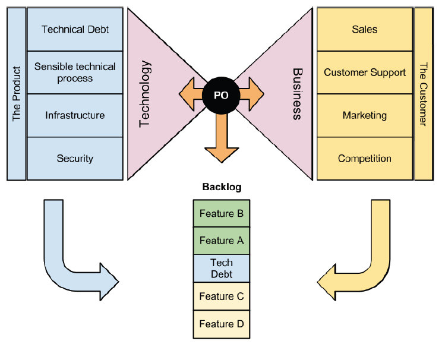

It’s no secret that agile software development is a loaded phrase these days. Every company “does agile” a bit differently. Regardless of how much of the agile process kool-aid your company is drinking, it’s likely that you have put in place a role called Product Owner (PO). It is also likely that every team interacts with their PO differently, and that every level of your organization has very different ideas about what that role is and what they represent.

I firmly believe the role of the PO is one of the most interesting and critical parts of agile software development. When done right, the PO can create a beautiful harmony of form and function in the process. When not done correctly, the PO can become a poorly informed dictator whose team outputs the wrong features and fixes at the wrong time. This will bubble up and result in the entire organization misunderstanding agile development.

Take a look at the following graphic and get familiar with its parts. We’ll identify the role of the PO and how they are supposed to operate within the organization by first identifying the interests of the Business and then of the Technology organization. Finally we’ll take a look at how the PO bridges that gap and how each component needs to work with the PO.

# What does “the Business” represent?
The Business represents the customer. They want to make sure that we are bringing the right features to market at the right time. The Business puts items in the product backlog based on input from several sources. Depending on what your company’s goals are you will want to listen to some parts more than others. For example, if the business goal is to increase retention, then listening to customer support may be more valuable than what sales or marketing is trying to vie for. Here’s a few of those components and how they influence business goals.

## Sales
Sales interfaces with current customers to try and get them to buy more, and with potential customers to try to get them to buy anything. Sales will come to the backlog with ideas for features they think will help them do that job better. They may have ideas about how a particular feature is asked for by lots of current customers, or how a feature may allow them to compete with another product more effectively.

## Customer Support
Your customer support department is a direct window to the quality of your product. Bugs that escape to production will create waves here. Likewise, if your design group misses the mark and a feature goes out with poor usability then support will be impacted just as much or more. Bugs often have workarounds, but there is no workaround for poor usability.

Support will want to see bugs and usability issues addressed in the backlog. As your product grows in complexity over time they’ll suggest better workflows or tools that simplify repetitious or complicated customer tasks.

## Marketing
Companies often want to build hype in the marketplace through social media, and attaching a date to that hype is exciting. This means that if a team wants to cut a feature because it is not going to be ready, marketing may push back on that hard.

## Competition and Opportunity
Market opportunities are the big feature drivers in your backlog, and potentially they are the game changers. It’s good to know that sales brings to the table predictable and safe feature ideas that you can be confident your customers will pay for. However, the idea for Amazon Web Services didn’t come from their current customers who were busy buying books and things online. It was a market opportunity they recognized and they went for it, and this proved to be a big disruption in the software development market that put Amazon way ahead of its competition..

## Priority
Each item on the Business’s backlog should have a priority. Priority is derived from value. Sales believes that, for them, feature A is worth more and is more important than feature B. Support knows that their call volume will be reduced by 3% if a particular workflow is simplified. How to go about managing this process is the subject of an article unto itself. The bottom line is that business goals drive work and must be prioritized.

# What does Technology represent?
Technology encompasses all the things that go into actually creating and maintaining the software and systems that the Business sells. These folks are developers, quality assurance members, automators, continuous integration/deployment technicians, infrastructure specialists, and production support engineers. They write code, maintain servers, write automated tests, perform exploratory testing, debug problems discovered in production, setup network switches, and do security scans against the network and software. So how do they influence the backlog? Shouldn’t they just respond to it? Absolutely not :)

## Technical Debt
The definition of technical debt is a bit outside the scope of this article. Suffice it to say that technical debt is just like financial debt: it starts small and grows larger over time. Like financial debt, it weighs your company down and slows progress. Technical debt is usually the result of making trade-offs in order to get results in a shorter time frame.

Technical debt may outright prevent a feature from being worked. Technology will, in these times, require that technical debt work be done before the features can be worked. In the example above this is illustrated by the position of feature C and D coming after the technical debt story. Clear communication between the PO and Technology regarding the value of fixing that technical debt is a key to having a cohesive team and retaining that goal driven backlog. That communication must flow back to the Business stakeholders through the PO.

## Sensible Technical Process
The Business does not understand, nor can they dictate, how something will be built. It is up to Technology to decompose Business goals into Epics and Stories that actually lay out the order and steps of what will be done. The Business may have a clear idea that feature A is far more important than feature B, but as you can see in the graphic above, Technology will push back on that priority because the technical challenges solved in feature B are more appropriately done before feature A is begun.

## Infrastructure & Security
Infrastructure and Security needs may not directly write stories, but they will certainly influence the way stories are written and the way technical debt is addressed. There is obviously a long list of similar concerns we could list here, but you get the idea.

# So... about that PO role...
So far we’ve been talking about the influencing components of the Business versus Technology. Obviously these two are at odds to a certain extent. The Business wants competitive features out the door as quickly as possible, while Technology wants to take the necessary time to build quality solutions ... a balance and understanding must be struck.

## Priority negotiator!

This is where your PO comes in to play. The PO sits between the Business and Technology and serves as a negotiator between the two bodies. Technology has a responsibility to represent their interests clearly and objectively. They also have a responsibility to understand the Business needs at play. The PO must work closely with the company product manager to understand why the priorities are what they are, and what value those stories represent. Then they have to communicate that fairly and completely to Technology. Technology must look for good and proper ways to meet the Business goals, and to think of an iterative way to do that. If technical debt must be addressed to move on, the Technology team must be honest about it and explain exactly why it is so to their PO. Transparency and trust is paramount between the two bodies, and the PO is the focal point of that relationship.

When Technology pushes back and wants to change the priority of feature B to come before A, the PO must understand why that is and then go back to the Business and represent that fairly and honestly. It is critical that this be a true and honest relationship. The PO cannot afford to get lazy and fall into the trap of doing favors for one side or the other, or of trying to pull the wool over the eyes of either side. The truth is, nobody in this equation is stupid - we all see through stuff like that quickly. Technologists as a rule trust logic and evidence and will very quickly stop trusting a PO they think is playing games.

Likewise, if the PO does not fairly represent their team to the Business then the developers could very well be subjugated to a role of some gruff and uncompromising people that the Business just has to find a way to manipulate. That means phrases like, “well you know how those folks are - they just want to do things their way” should never come from a PO’s mouth to anyone on either side.

## Goal oriented: Bring goals or problems to the team, not solutions
Something else a PO must be careful to avoid doing is coming to the team with a solution to implement. Your technology employees are highly skilled, highly intelligent people. If you turn them into code monkeys by bringing them solutions to implement you are wasting talent and short changing your organization. The PO must be able to articulate business objectives to the team and then allow them to come up with the solutions. Make sure the team understands the value that each goal represents.

Obviously, the solutions that the team comes up with must satisfy that goal. We know that engineers can create some very impressive and complicated ideas. Sometimes those ideas stray too far from the goal, and the PO will need to steer the team back. At the end of the day, the PO is accountable to the rest of the business for the solutions the team implements.

## Not a manager
The PO is a member of the cross functional team and should attend retrospectives, be visible at reviews, and be there every day at the daily stand-up meeting. He is subject to his teams criticism just like any other member of the organization and he needs to be self aware and receptive to that. The PO is a colleague, not a manager, and under no circumstance should the PO dictate tasks or attempt to micro manage team members. On an agile team there is no room for individuals who cannot self direct.

For this reason I truly believe that making a functional or HR related manager a PO is a mistake (similarly, making that person a scrum master or combining scrum master and PO is also a mistake - make a developer a scrum master, not the PO). A manager’s presence in a meeting changes the dynamic immediately. Very few people can separate out roles effectively. The manager will try to give direction and it will come across as dictation. Or, the manager will get frustrated and dictate action just to get something done and therefore sacrifice agility and quality without even meaning to. Team members won’t push back because they can’t tell if their manager is talking to them or their PO.

Bottom line is, someone with the power to give raises, hire, or fire people should not be a PO because you can’t negotiate with people you manage, it just doesn’t work. If you are reading this and you are a manager/PO and you are thinking to yourself, “you are crazy, this is working great!” then I challenge you to send this article to your team members and let them type up their responses and leave it anonymously on your desk (or, better yet, your bosses desk).

# Conclusions
Obviously the role of PO is a complicated, intricate balancing act. It takes a very special personality to do it really well. You have to have a technically capable mind. You may not do development, but you had better be able to understand their language and what they do. You must have great soft skills. You are not a manager of people, but you are a leader without a doubt. The people who see you as a leader must feel comfortable telling you “no” when you ask for something improper. That means that they must trust you, and you must never abuse that trust.

Of all the roles in an agile organization, the PO is by far the most interesting and challenging in my mind. Partner with your team, be goal driven, and be flexible.
